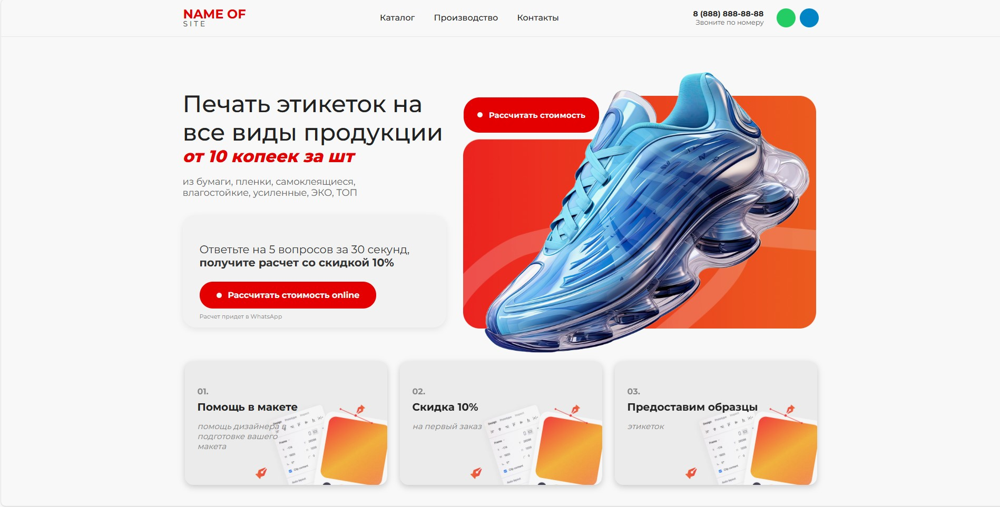
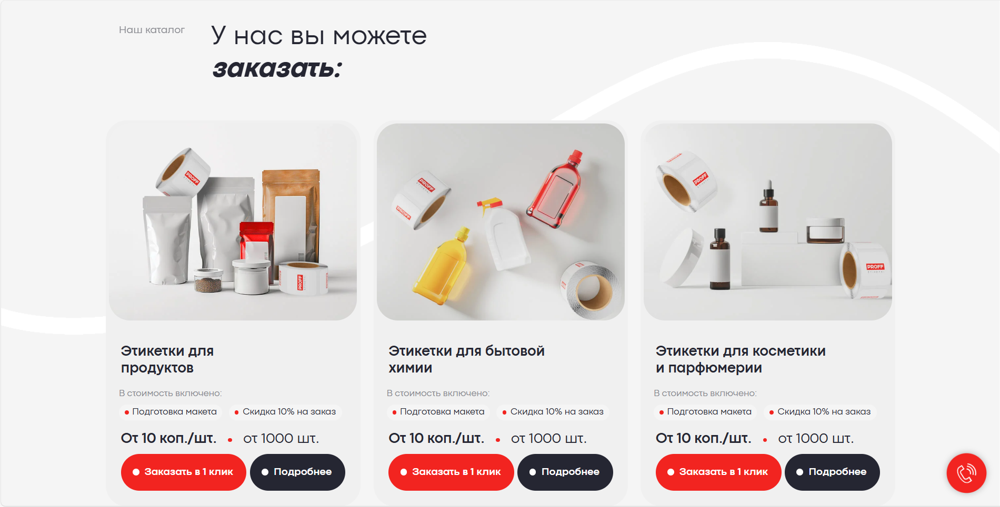
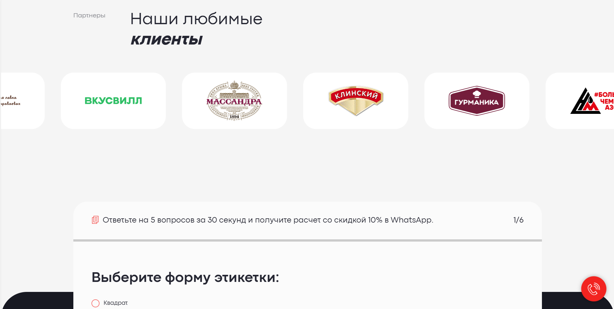
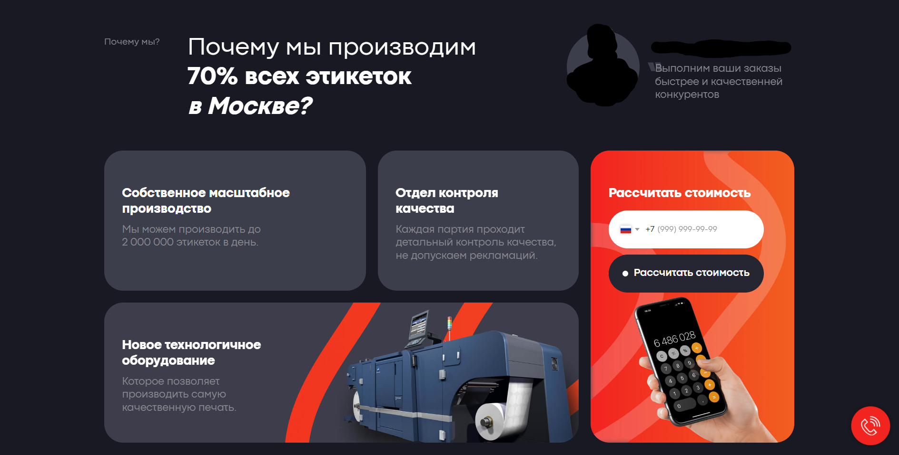
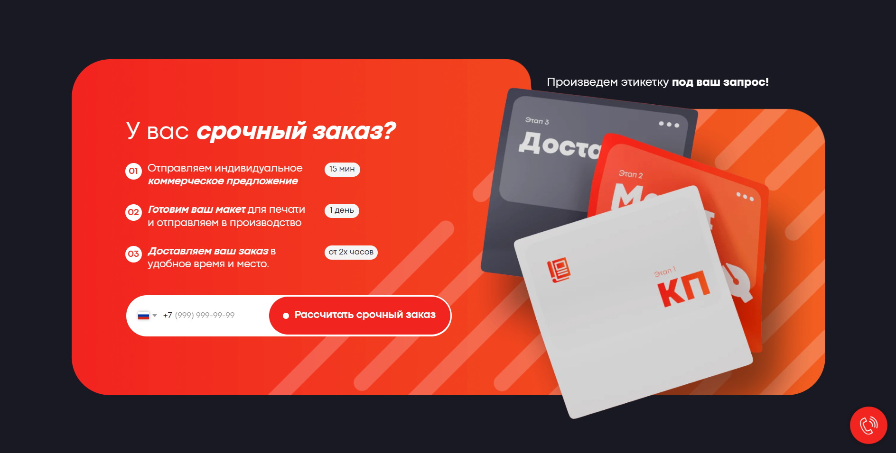
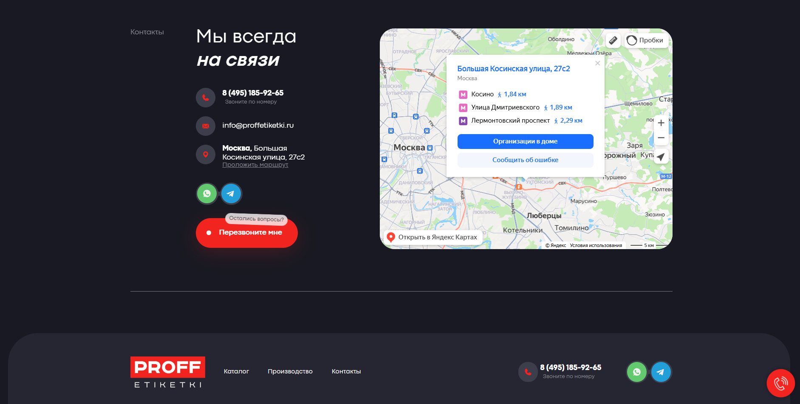

# 🎨 Сайт «Печать этикеток»

Адаптивный лендинг для печати этикеток на все виды продукции. Сделан с использованием чистого HTML, CSS и JavaScript. Включает каталог продукции, форму расчёта стоимости и квиз.

---

## 🌟 Основные возможности

- Полностью адаптивный дизайн
- Каталог с карточками товаров
- Квиз из 5 шагов с формой заказа
- Анимированные разделы
- Секция партнёров с каруселью
- Интерактивные кнопки и плавные переходы

---

## 📸 Скриншоты

*(Добавь сюда свои картинки — сохрани их в папке `/assets/screenshots` и замени пути)*

### 🏠 Главная страница


### 📚 Каталог продукции


### ✅ Форма квиза


### ✅ Форма квиза


### ✅ Форма квиза


### ✅ Форма квиза

---

## 💻 Технологии

- HTML5
- CSS3
- Vanilla JavaScript

---

## 🚀 Запуск локально

Клонируйте репозиторий и откройте файл `main.html` в браузере:

```bash
git clone https://github.com/KiryaBasik/landing-page.git